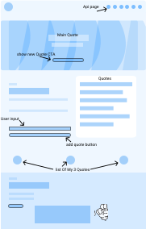

# Quote Generator  
# Link to the site https://amigo-quotes.netlify.app/
## About The Project

### With a great Talk from Amigo they ask me for a second interview work plan.
### As of the project I had to build a quote generator using either local storage , session storage or a database, then be able to add users own quote to it.   
### I decided to go with both database storage and local storage.
### one used for saving users data and the other for using an API since I did not want to save API data to the limited storage I decided to make two pages of content for them.
### I roughly spend most of The day on the landing page with great success to each component, pretty much having most of the setup memorised untill i hit firebase but it was a great learning curve and remind that software is allway's upgrading so you never stop learning.

 
Technologies Used

- Figma
- React 
- styled compoents (B.E.M) — Block Element Modifier
- FireBase (New Verson update)
- Api's [https://type.fit/api/quotes]
- jest
- netlify hosting

 

## Getting Started 

` npm create-react-app  `  
` npm install --save react-router-dom`  
` npm i styled-components`  
` npm install react-icons --save`
 

## WireFrames

These are my Low/Mid fedelity Wireframes.  
Since i had a time limit i did not want to get hooked into doing wireframes for many days like i tend todo, so I spent most of the time building the site since things change while building.   

Decided to try make my site as close to Amigos hero section but with my own nab links.  
I also got user feedback from two Ux/Ui friend's on the layout and both agreed they liked it :)   

 

## Trouble Shooting  
There was alot of Problems when it came to the database i thought it would be a  great idea to use pre written code i had used with firebase to just get the data back and to send it but . . .  
Firebase has recently upgraded their code to use a new layout so i had to google search and trial and test untill i could get it working.

I really enjoyed working on this project.
Next time im going to try mongoDb Atlas, since i have been learning that and it seems very simple like firebase they now use cloud storage with async data

# Author: Jordan Linton

